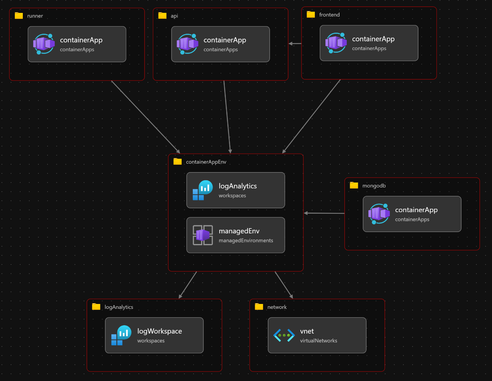

# Deploy to Azure with Bicep

A Bicep template is provided that deploys all of NanoMon using [Azure Container Apps](https://learn.microsoft.com/en-us/azure/container-apps/overview)

Ensure you are on the latest version of the Azure CLI.  
Make a copy of `example.bicepparam` if you wish and modify the parameters, or simply deploy "as is"

First fetch/update the latest sub-modules required for the templates

```
git submodule update --init --recursive
```

Then deploy using the bash helper script

```bash
cd deploy/azure
./deploy.sh myparams.bicepparam
```

### Resources



## Notes

By default the template will deploy a new VNet and link the Container Apps Environment to it, then create all the NanoMon containers + Postgres container. This will take quite some time to deploy, but as the MongoDB container requires TCP ingress, a custom VNet is [the only way to support that](https://learn.microsoft.com/en-us/azure/container-apps/ingress-overview#tcp).

If you set `externalMongoDbURI` to point to an existing MongoDB (e.g. running in Azure Cosmos DB) then deployment will be _much_ quicker as no VNet will be created and no MongoDB container deployed.
