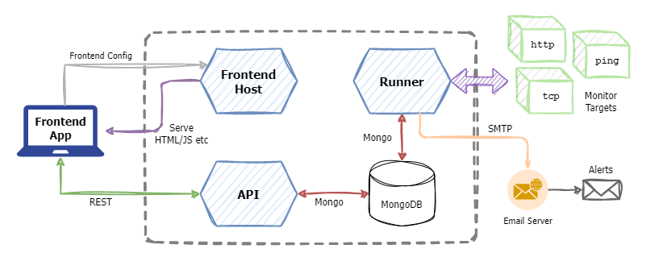

# NanoMon - Monitoring Tool

NanoMon is a lightweight network and HTTP monitoring system, designed to be self hosted with Kubernetes (or other container based system). It is written in Go and based on the microservices pattern, as such it is decomposed into several discreet but interlinked components.

It also serves as a reference & learning app for microservices and is used by my Kubernetes workshop as the workload & application deployed in order to demonstrate Kubernetes concepts.

In a hurry? - Jump to the sections [running locally quick start](#) or [deploying with Helm](#)

## Architecture

The archiecture is very simple

## Concepts

NanoMon executes monitoring calls remotely over the network using standard protocols, it does this periodically on a set interval per monitor. The results & execution of a "run" is validated to determine the status or success. There are currently three statuses:

- **OK** &ndash; Indicates no problems, e.g. got a HTTP valid response.
- **Error** &ndash; Partial success as one or more rules failed, e.g. HTTP status code wasn't the expected value. See rules below.
- **Failed** &ndash; The monitor failed to run entirely e.g. connection, network or DNS failure.

### Monitor

A _monitor_ represents an instance of a given monitor _type_ (see below) with it's associated configuration. Common properties of all monitors include the interval on which they are run, and the target. The target is _type_ dependant but typically is a hostname or URL.

### Result

When a _monitor_ runs it generates a _result_. The _result_ as the name implies, holds the results of a run of a monitor, such as the timestamp, status, message and a value. The value of a _result_ is dependant on the type of _monitor_ however it currently represents the duration of the execution in millseconds.

### Monitor Type

- HTTP
- Ping
- TCP

## Components

- **API** - REST API acting as interface for the frontend
- **Runner** - Monitors execute from here
- **Frontend** - The web interface, i.e. the HTML and JS
- **Frontend Host** - The server host for the frontend
- **MongoDB** - Backend data store

## Repo Index

## Getting Started

## Configuration

All configuration should be provided in the form of environmental variables

Env vars used by both API service and runner:

| _Name_        | _Description_                                | _Default_                 |
| ------------- | -------------------------------------------- | ------------------------- |
| MONGO_URI     | Connection string for MongoDB                | mongodb://localhost:27017 |
| MONGO_DB      | Database name to use                         | nanomon                   |
| MONGO_TIMEOUT | Timeout for connecting to & querying MongoDB | 10s                       |

Env vars used by the API and frontend host:

| _Name_         | _Description_                     | _Default_   |
| -------------- | --------------------------------- | ----------- |
| PORT           | TCP port for service to listen on | 8000 & 8001 |
| AUTH_CLIENT_ID | Used to enable authentication     | _blank_     |

Env vars used only by the frontend host:

| _Name_       | _Description_                                    | _Default_ |
| ------------ | ------------------------------------------------ | --------- |
| API_ENDPOINT | Instructs the frontend SPA where to find the API | /api      |

Env vars used only by the runner:

| _Name_                  | _Description_                                                      | _Default_      |
| ----------------------- | ------------------------------------------------------------------ | -------------- |
| MONITOR_CHANGE_INTERVAL | How frequently to check for configuration changes                  | 120s           |
| ALERT_SMTP_PASSWORD     | For alerting, the password for mail server                         | _blank_        |
| ALERT_SMTP_FROM         | From address for alerts, also used as the username                 | _blank_        |
| ALERT_SMTP_TO           | Address alert emails are sent to                                   | _blank_        |
| ALERT_SMTP_HOST         | SMTP hostname                                                      | smtp.gmail.com |
| ALERT_SMTP_PORT         | SMTP port                                                          | 587            |
| ALERT_FAIL_COUNT        | How many time a monitor needs to fail in a row to trigger an alert | 3              |

## Scratch Notes Area

Using Cosmos DB
Add index for the `date` field to the results collection
`az cosmosdb mongodb collection update -a $COSMOS_ACCOUNT -g $COSMOS_RG -d nanomon -n results --idx '[{"key":{"keys":["_id"]}},{"key":{"keys":["date"]}}]'`

HELM REPO
helm repo add nanomon 'https://raw.githubusercontent.com/benc-uk/nanomon/main/deploy/helm'
