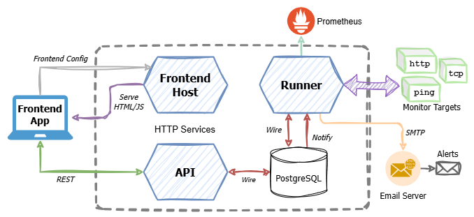

# NanoMon - Monitoring Tool

NanoMon is a lightweight network and HTTP monitoring system, designed to be self hosted any container based system e.g. Kubernetes or various cloud services, or run locally. It is written in Go and based on the now ubiquitous (infamous?) microservices pattern, so is decomposed into several discreet but interlinked components. The features of NanoMon include:

- A range of configurable monitor types
- Web frontend for viewing results & editing/creating monitors
- Email alerting
- Range of deployment options
- Rules for setting monitor status on thresolds, or other checks
- OAuth2 based user sign-in and authentication
- Exporting of metrics & data to Prometheus

It also serves as a reference & learning app for microservices and is used by my Kubernetes workshop as the workload & application deployed in order to demonstrate Kubernetes concepts.

In a hurry? - Jump to the sections [running locally quick start](#local-dev-quick-start) or [deploying with Helm](#deploy-to-kubernetes-using-helm)

## Architecture

The architecture is a fairly standard design, consisting of four application components and a database.



- **API** - API provides the main interface for the frontend and any custom clients. It is RESTful and runs over HTTP(S). It connects directly to the database.
- **Runner** - Monitor runs are executed from here (see [concepts](#concepts) below). It also connects directly to the database, and reads monitor configuration data, and saves back & stores result data.
- **Frontend** - The web interface is a SPA (single page application), consisting of a static set of HTML, JS etc which executes from the user's browser. It connects directly to the API, and is developed using [React](https://react.dev) and [Vite](https://vite.dev/)
- **Frontend Host** - The static content host for the frontend app, which contains no business logic. This simply serves frontend application files HTML, JS and CSS files over HTTP. In addition it exposes a small configuration endpoint.
- **PostgreSQL** - Backend data store, this is a standard instance of the PostgreSQL database server (often called just postgres). Versions 16 and 17 have been tested.

## Concepts

NanoMon executes monitoring calls remotely over the network using standard protocols, it does this periodically on a set interval per monitor. The results & execution of a "run" is validated to determine the status or success. There are currently three statuses:

- **OK** – Indicates no problems, e.g. got a HTTP valid response.
- **Error** – Partial success as one or more rules failed, e.g. HTTP status code wasn't the expected value. See rules below.
- **Failed** – The monitor failed to run entirely e.g. connection, network or DNS failure.

### Monitor

A _monitor_ represents an instance of a given monitor _type_ (see below) with it's associated configuration. Common properties of all monitors include the interval on which they are run, and the target. The target is _type_ dependant but typically is a hostname or URL.

### Result

When a _monitor_ runs it generates a _result_. The _result_ as the name implies, holds the results of a run of a monitor, such as the timestamp, status, message and a value. The value of a _result_ is dependant on the type of _monitor_ however it most commonly represents the duration of the network request in milliseconds.

### Monitor Types

There are three types of monitor currently supported:

- **HTTP** – Makes HTTP(S) requests to a given URL and measures the response time.
- **Ping** – Carries out an ICMP ping to the target hostname or IP address.
- **TCP** – Attempts to create a TCP socket connection to the given hostname and port.
- **DNS** – Looks up DNS records for a given hostname or domain name.

For more details see the [complete monitor reference](#monitor-reference)

## Repo & Project Details

```text
📂
 ├── .dev         // Local dev config & tools
 ├── api          // API specs, OpenAPI, TypeSpec & Bruno
 ├── build        // Build Dockerfiles
 ├── deploy       // Deployment artifacts; Helm, Kubernetes, Azure Bicep
 ├── docs         // Documentation, guides and diagrams
 ├── frontend     // Source for the frontend app, written in React
 ├── scripts      // Supporting scripts
 ├── services     // Source for backend services, API, runner and frontend host
 │   ├── api
 │   ├── common
 │   ├── frontend
 │   └── runner
 ├── sql          // Database schema & init scripts
 └── tests        // Integration & performance tests
```

[](https://github.com/benc-uk/nanomon/actions/workflows/ci-build.yml)

   

## Getting Started

Here are the most common options for quickly getting started running locally, or deploying to the cloud / Kubernetes.

### Quick Start & Run

If you just want to try the app out, you can start the standalone image using Docker. This will run the entire system in a single container, which is useful for demos and quick testing. The standalone image includes the API, runner, frontend host and a PostgreSQL database.

```bash
docker pull ghcr.io/benc-uk/nanomon-standalone:latest
docker run --rm -it -p 8000:8000 -p 8001:8001 ghcr.io/benc-uk/nanomon-standalone:latest
```

Then open the following URL http://localhost:8001/ to access the frontend app.

### Local Dev Quick Start

Pre-reqs:

- Linux system like Ubuntu (WSL was used for development), MacOS might work 🤷‍♂️
- [Docker engine & CLI](https://docs.docker.com/engine/install/ubuntu/), Podman should also work, but hasn't been extensively tested.
- [Go SDK & toolchain](https://go.dev/doc/install)
- [Node.js](https://nodejs.org/en/download)
- [Just](https://just.systems) task runner and make replacement
  - If you're not keen on installing another binary on your system or into your PATH, run `./scripts/install-just.sh` which puts the binary into the local project, then you can run `.dev/just`
  - When working locally, copy the `.dev/.env.sample` to `.dev/.env` and set any configuration variables in the file.

To run all the components directly on your dev machine. You will need to be using a Linux compatible system (e.g. WSL or a MacOS) with bash, make, Go, Docker & Node.js installed. You can try the provided [devcontainer](https://containers.dev/) if you don't have these pre-reqs.

- Run `just dev-tools` to install the dev tools into the `.dev` directory.
- Run `just run-all`
- The frontend should automatically open in your browser.

### Deploy to Kubernetes using Helm

See [Helm & Helm chart docs](./deploy/helm/)

### Deploy to Azure Container Apps with Bicep

See [Azure & Bicep docs](./deploy/azure/)

## Components & Services

### Runner

- Written in Go, [source code - /services/runner](./services/runner/)
- The runner requires a connection to PostgreSQL in order to start, it will retry and eventually exit if the connection fails.
- It dynamically keeps in sync with the `monitors` table in the database. This is achieved by using the listen/notify feature of PostgreSQL, which is used to listen for notification messages without the need for polling. These messages are sent using triggers & stored procedures, which are called when a monitor is created, updated or deleted.
- If configured the runner will send email alerts, see [alerting section below](#alerting-configuration)
- By default runner doesn't listen to inbound network connections or bind to any ports, the exception being if [Prometheus support is enabled](#appendix-prometheus)

### API

- Written in Go, [source code - /services/api](./services/api/)
- The API requires a connection to PostgreSQL in order to start, it will retry and eventually exit if the connection fails.
- Listens on port 8000 by default.
- All routes are prefixed `/api` this makes it easier to put a path based HTTP router in front of the API and the SPA frontend
- Makes use of the [benc-uk/go-rest-api](https://pkg.go.dev/github.com/benc-uk/go-rest-api) package.
- The API is RESTful, see the [API folder](./api/) for specifications and sample .http file.
- By default no there is no authentication or validation, and all API calls are allowed, see [authentication & security](#authentication--security) section for details.

### Frontend

- Written in TypeScript + React v19, using the Vite project scaffolding `npm create vite@latest`, the source code is in [/frontend](./frontend)
- Vite is used for bundling, and local serving with HMR
- Configuration is fetched from the URL `/config.json` at start up.
  - When hosted by the frontend-host this allows for values to be dynamically passed to the frontend at runtime.
  - When running locally the makefile target `just run-frontend` builds a static config file to "fake" this config API.
- By default no there is no authentication on the frontend, this makes the app easy to use for demos & workshops. However it can be enabled see [authentication & security](#authentication--security) section for details. The MSAL library is used for auth [see MSAL.js 2.0 for Browser-Based SPAs](https://github.com/AzureAD/microsoft-authentication-library-for-js/tree/dev/lib/msal-browser) and [MSAL React](https://github.com/AzureAD/microsoft-authentication-library-for-js/tree/dev/lib/msal-react)

### Frontend Host

- Written in Go, source code is in[/services/frontend](./services/frontend/) (Note. Don't confuse with the `/frontend` directory)
- A simple static HTTP server for hosting & serving the content & files of the frontend app
- Listens on port 8001 by default.
- Provides a single special API endpoint served at `/config.json` which reflects back to the frontend certain environmental variables (see [configuration](#configuration-reference) below)

## Just Reference

```text
 🔸build                   # 🔨 Build binaries and bundle the frontend
 🔸clean                   # 🧹 Clean up, remove dev data and temp files
 🔸dev-tools               # 🔮 Install dev tools into project tools directory
 🔸format                  # 📝 Format source files and fix linting problems
 🔸generate-specs          # 🤖 Generate OpenAPI specs and JSON-Schemas using TypeSpec
 🔸helm-prep               # 🪖 Update Helm docs & repo index
 🔸images                  # 📦 Build all container images, using Docker compose
 🔸lint fix="false"        # 🔍 Lint & format, default is to check only and set exit code
 🔸push                    # 📤 Push all container images
 🔸remove-db               # 🌊 Remove Postgres container and its data volume
 🔸run-all                 # 🚀 Run all services locally with hot-reload, plus Postgres
 🔸run-api                 # 🎯 Run the API service locally, with hot reloading
 🔸run-db                  # 🐘 Run Postgres in container
 🔸run-frontend            # 🌐 Run React frontend with Vite dev HTTP server & hot-reload
 🔸run-runner              # 🏃 Run the runner service locally, with hot reloading
 🔸test                    # 🧪 Run all unit tests
 🔸test-api report="false" # 🔬 Run API integration tests, using HttpYac
```

## Configuration Reference

All three components (API, runner and frontend host) expect their configuration in the form of environmental variables.  
When running locally this is done with a dotenv file, which is located in `.dev\.env` along with a sample to be used to get started. The `.env` file is used solely for local development.

### Variables used only by the frontend host:

| _Name_       | _Description_                                    | _Default_ |
| ------------ | ------------------------------------------------ | --------- |
| API_ENDPOINT | Instructs the frontend SPA where to find the API | /api      |

### Variables used by both API service and runner:

| _Name_            | _Description_                                                                               | _Default_ |
| ----------------- | ------------------------------------------------------------------------------------------- | --------- |
| POSTGRES_DSN      | Connection string in DSN format for PostgreSQL, see [notes below](#appendix-database-notes) | _blank_   |
| POSTGRES_PASSWORD | Password for connecting to PostgreSQL, see [notes below](#appendix-database-notes)          | _blank_   |

### Variables used by _both_ the API and frontend host:

| _Name_         | _Description_                                                                                                  | _Default_   |
| -------------- | -------------------------------------------------------------------------------------------------------------- | ----------- |
| PORT           | TCP port for service to listen on                                                                              | 8000 & 8001 |
| AUTH_CLIENT_ID | Used to enable authentication with given Azure AD app client ID. See [auth section](#authentication--security) | _blank_     |
| AUTH_TENANT    | Set to Azure AD tenant ID if not using common                                                                  | common      |

### Variables used only by the runner:

> Note. All settings for alerting that begin with `ALERT_` are optional

| _Name_              | _Description_                                                                          | _Default_             |
| ------------------- | -------------------------------------------------------------------------------------- | --------------------- |
| ALERT_SMTP_PASSWORD | For alerting, the password for mail server                                             | _blank_               |
| ALERT_SMTP_FROM     | From address for alerts, also used as the username                                     | _blank_               |
| ALERT_SMTP_TO       | Address alert emails are sent to                                                       | _blank_               |
| ALERT_SMTP_HOST     | SMTP hostname                                                                          | smtp.gmail.com        |
| ALERT_SMTP_PORT     | SMTP port                                                                              | 587                   |
| ALERT_FAIL_COUNT    | How many times a monitor returns a non-OK status, to trigger an alert email            | 3                     |
| ALERT_LINK_BASEURL  | When hosting NanoMon and you want the link in alert emails to point to the correct URL | http://localhost:3000 |
| POLLING_INTERVAL    | Only used when in polling mode, when change stream isn't available                     | 10s                   |
| PROMETHEUS_ENABLE   | Enable exporting metrics in Prometheus format (see below)                              | false                 |
| PROMETHEUS_PORT     | HTTP port used to serve the Prometheus metrics                                         | 8080                  |

## Monitor Reference

NanoMon currently supports four types of monitor, which can be configured various ways, this is a reference for each monitor type, the runtime behaviour, properties that can be set, and the resulting outputs.

### HTTP Monitor

This makes a single HTTP request to the target URL each time it is run, it will return failed status in the event of network failure e.g. no network connection, unable to resolve name with DNS, invalid URL etc. Otherwise any sort of HTTP response will return an OK status. If you want to check the HTTP response code, use a rule as described above e.g. `status == 200` or `status >= 200 && status < 300`.

- **Target:** A URL, with HTTP scheme `http://` or `https://`
- **Value:** Time to complete the HTTP request & read the response in milliseconds.
- **Properties:**
  - _method_ - Which HTTP method to use (default: "GET")
  - _timeout_ - Timeout interval e.g. "10s" or "500ms" (default: 5s)
  - _validateTLS_ - Set to "false" to disable TLS cert validation (default: "true")
  - _body_ - Body string to send with the HTTP request (default: none)
  - _headers_ - HTTP headers as JSON object, e.g. `{"content-type": "application/json"}` (default: none)
  - _bodyRegex_ - Run this regEx against the body, and sets `regexMatch` output (default: none)
- **Outputs / Rule Props:**
  - _respTime_ - Same as monitor value (number)
  - _status_ - HTTP status code (number)
  - _body_ - The response body (string)
  - _bodyLen_ - The number of bytes in the response (number)
  - _certExpiryDays_ - Number of days before the TLS cert of the site expires (number)
  - _regexMatch_ - Match of the bodyRegex if any (number or string)

### TCP Monitor

Each time a TCP monitor runs it attempts to open a TCP connection to given host on the given port, it will return failed status in the event of network/connection failure, DNS resolution failure, or if the port is closed or blocked. Otherwise it will return OK.

- **Target:** A hostname (or IP address) and port tuple, separated by colon
- **Value:** Time for TCP connection to open in milliseconds.
- **Properties:**
  - _timeout_ - Timeout interval e.g. "10s" or "500ms" (default: 5s)
- **Outputs / Rule Props:**
  - _respTime_ - Same as monitor value (number)
  - _ipAddress_ - Resolved IP address of the target (string)

### Ping Monitor

This monitor will send one or more ICMP ping packets to the given host or IP address, it will return failed status in the event of network/connection failure, unable to resolve name with DNS Otherwise it will return OK.

Note. As this monitor needs to send ICMP packets, the runner process needs certain OS privileges to do that otherwise you will see `socket: operation not permitted` errors. When running inside a container it runs as root so there is no issue. When running locally if you want to use this monitor type, build the runner binary with `just build` then start the runner process with sudo e.g. `sudo ./bin/runner`

- **Target:** A hostname or IP address.
- **Value:** Average round trip time in milliseconds.
- **Properties:**
  - _timeout_ - Timeout interval e.g. "10s" or "500ms" (default: 1s)
  - _count_ - Number of packets to send (default: 3)
  - _interval_ - Interval between packets (default: 150ms)
- **Outputs / Rule Props:**
  - _minRtt_ - Min round trip time of the packets (number)
  - _avgRtt_ - Avg round trip time of the packets (number)
  - _maxRtt_ - Max round trip time of the packets (number)
  - _packetsRecv_ - How many packets were received (number)
  - _packetLoss_ - Percentage of packet that were lost (number)
  - _ipAddress_ - Resolved IP address of the target (string)

### DNS Monitor

The DNS monitor looks up DNS records and returns the results as outputs, if the name fails to resolve it will return failed status, otherwise it will return OK.

- **Target:** The domain or hostname you want to lookup in DNS
- **Value:** Time for lookup to complete
- **Properties:**
  - _timeout_ - Timeout interval e.g. "500ms" (default: 2s)
  - _type_ - Type of DNS record to query, one of; 'A', 'CNAME', 'TXT', 'MX or 'NS' (default: 'A')
  - _server_ - Hostname or IP of DNS server to use for querying (default: use the DNS server configured in the OS of the runner)
  - _network_ - Network to use and sorts of addresses to return, one of; 'ip4', 'ip6' or 'ip' (default: 'ip')
- **Outputs / Rule Props:**
  - _respTime_ - Same as monitor value (number)
  - _resultCount_ - Number of records returned from the query (number)
  - _result1_, _result2_ etc - Each result of the query returned as a separate numbered output (string)

### Monitor Rules

All monitor types have a rule property as part of their configuration, this rule is a logical expression which is evaluated after each run. You can use any of the outputs in this expression in order to set the result status of the run.

The rule expression should always return a boolean, a false value will set the result to error status, anything else will leave the status as is (i.e. OK or failed) you can use a [range of operators in the rule expression](https://github.com/Knetic/govaluate#what-operators-and-types-does-this-support), such as logical `AND`, `OR`, `NOT` etc plus other advanced operators like `=~` for regex searching (e.g string contains).

Some rule examples:

```bash
status >= 200 && status < 300          # Check for OK range of HTTP status codes
status == 200 && respTime < 5000       # Check status code and response time
'93.184.215.14' IN (result1, result2)  # Check IP in multiple DNS results
body =~ 'some words'                   # Look for a string in the HTTP body
regexMatch == 'a value'                # Check the value of the RegEx match
```

## Authentication & Security

By default there is no authentication, security or user sign-in. This is by design to make the app easy to deploy, and for use in learning scenarios and workshops.

Security is enabled using the Microsoft Identity Platform (now called Microsoft Entra ID) and OAuth2 + OIDC. With an app registered in Entra ID, then passing the app's client id as `AUTH_CLIENT_ID` to the NanoMon services. Setting this changes the behaviour of the application as follows:

- **API** - Will enforce validation on certain API routes, like POST, PUT and DELETE, using OAuth 2.0 JWT bearer tokens. The token is checked for validity as follows; contains a scope matching `system.admin` and has an audience matching the client id.
- **Frontend host** - The UI will show a sign-in button and only allow signed-in users to create, edit or delete monitors. Access tokens are fetched from Entra ID for the signed-in user with the `system.admin` scope, and then passed when calling the API as bearer tokens.

A basic guide to set this up:

- Register a new app in Microsoft Entra ID, his needs to have the API scope `system.admin` exposed, and also be set with the correct SPA redirect URLs. To simplify this creation, use the provided bash script: `./scripts/aad-app-reg.sh`, or use [the portal](https://entra.microsoft.com/#home).
- Test locally - Put the provided client id as the `AUTH_CLIENT_ID`, in your `.env` file, then (re)start the frontend and API with `just run-api` and frontend with `just run-frontend`. You should see a login button on the page, and no way to create or edit monitors until you sign-in.
- For deploying elsewhere:
  - Get the frontend URL of the deployed running instance.
  - Add this URL to the SPA redirect URIs in the app registration. It's probably easiest doing this in the Azure Portal.
  - Update or redeploy app, setting `AUTH_CLIENT_ID` on the both frontend host and API containers.

## Alerting Configuration

NanoMon provides basic alerting support, which sends emails when monitors return a non-OK status 1 or more times in a row. By default this alerting feature is not enabled, and failing monitors will not trigger emails.

To enable alerting all of the env vars starting `ALERT_` will need to be set, there are six of these as described above. However as three of these variables have defaults, you only need to set the remaining three `ALERT_SMTP_PASSWORD`, `ALERT_SMTP_FROM` and `ALERT_SMTP_FROM` to switch the feature on, this will be using GMail to send emails. For the password you will need [setup an Google app password](https://support.google.com/accounts/answer/185833?hl=en) this will use your personal Google account to send the emails, so this probably isn't a good option for production (putting it mildly).

Limitations:

- Only been tested with the GMail SMTP server, I have no idea if it'll work with others! ¯\\\_(ツ)\_/¯
- The from address is also used as the login user to the SMTP server.
- Only a single email address can be set to send emails to.
- Restarting the runner will resend alerts for failing monitors.
- No follow up email is sent when a monitor returns to OK.

## Appendix: Database Notes

The database used by NanoMon is PostgreSQL, the runner makes use of the listen/notify feature to keep in sync with the monitors table, and to trigger runs of monitors. The API and frontend host connect directly to the database.

To see how the trigger & notify is setup within PostgreSQL, see the [nanomon_init.sql](./sql/init/nanomon_init.sql) which is run when the database is created. This file is used by the deployment scripts to create the initial database and tables, and also to create the triggers and stored procedures.

The DSN connection string for PostgreSQL is in the format used by pq, which is a Go driver for PostgreSQL. See [pq docs](https://pkg.go.dev/github.com/lib/pq#hdr-Connection_String_Parameters). The format is:

```php
host={host} port={port} user={user} dbname={dbname}
```

Note. It's advised to not include `password=` in the DSN, instead set the `POSTGRES_PASSWORD` environment variable. Should password be present in the DSN, it will be used, but should `POSTGRES_PASSWORD` be set too, it will override it.

When starting up the API and runner services, they will attempt to connect to the database, if the connection fails they will retry for a period of time (6 tries with 10 seconds between) before exiting. This is to allow the database to start up first, or to allow the database to be created by the deployment scripts. They will additional ping the database every 15 seconds to check the connection is still healthy, and will attempt to reconnect if the database becomes unavailable.

## Appendix: Prometheus

NanoMon has support for Prometheus metrics, which are exposed from the runner service via HTTP in the standard text-based exposition format. When configuring NanoMon as a scraping target use the url `http://<runner-host>:8080/metrics` (the port can be changed with `PROMETHEUS_PORT`)

This feature is disabled by default and is enabled by setting the `PROMETHEUS_ENABLE` env var, when enabled the metrics can be fetched/scraped from the `/metrics` endpoint. The active monitors will be provided as labelled Prometheus gauges (one gauge per monitor), these labels will hold the values for the monitor status (0 = OK, 1 = Error, 2 = Failed), and values of each numeric monitor output (string outputs are not applicable to Prometheus)

Using Prometheus means you many not need to run the NanoMon frontend, as you can visualize the data through other tools, and optionally enable things like the Prometheus alerts.

Example of metrics

```
# HELP nanomon_example_monitor Example Monitor (http)
# TYPE nanomon_example_monitor gauge
nanomon_example_monitor{id="6722474d0c73d60184f14c73",result="_status",type="http"} 0
nanomon_example_monitor{id="6722474d0c73d60184f14c73",result="_value",type="http"} 178
nanomon_example_monitor{id="6722474d0c73d60184f14c73",result="bodyLen",type="http"} 15256
nanomon_example_monitor{id="6722474d0c73d60184f14c73",result="respTime",type="http"} 178
nanomon_example_monitor{id="6722474d0c73d60184f14c73",result="status",type="http"} 404
```
